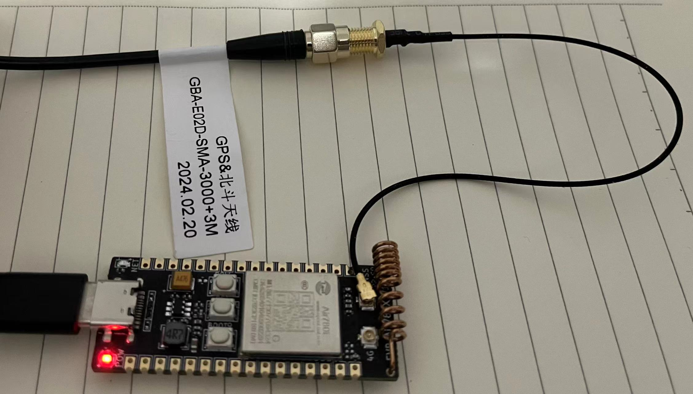
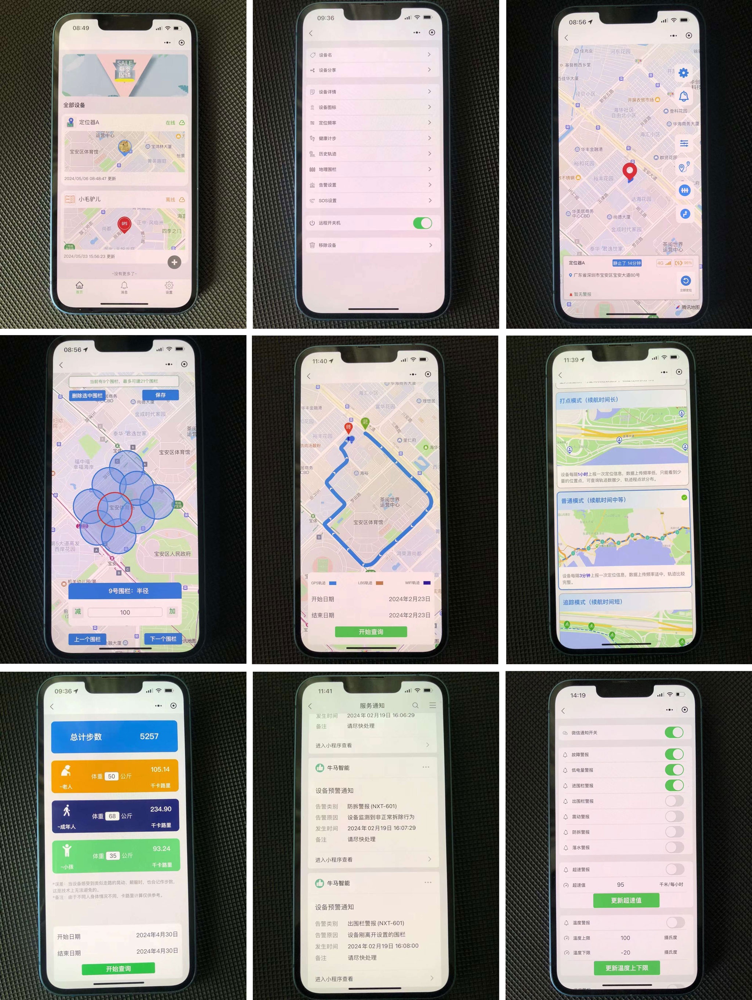

# 这是一套用合宙Air780EG做4G定位器、对接我们IoT平台的源代码
## 我们平台：https://iot-saas-admin.newxton.com/  （以MQTT方式对接设备）

请按照合宙C-SDK文档进行配置环境：
https://air780eg.cn

然后，把这套代码放到 luatos-soc-2022\project 目录下，即可进行修改、编译。

开发板，请购买Air780EG，99元，带GPS延长天线那个。

购买连接：https://item.taobao.com/item.htm?_u=u209n8ib8767dc&id=699112195445&spm=a1z09.2.0.0.70382e8dOGYHRZ

### 本套代码已经把网络通信交互、LBS定位、内置GPS定位基本完成。外设数据通信还需靠你们自己去做，比如低功耗管理、电源、电池、充电管理、陀螺仪等等其它功能，需要你们自己做上去。

你们只要将本套代码稍稍改一下就可以轻松做出一款4G定位器产品，然后将PCBA量产卖给你们的客户。

### 文档请查看document目录，内有通讯协议文档、设备对接技术说明文档。

# 我们平台已经有现成的定位器小程序、现成的后台管理系统（目前仅支持中国大陆区域）。

### 现成的精美小程序

每一个客户，如有需要，可以按照你们的logo和名字，改一套中性的小程序提供给你们部署。

## 收费项目费用
### 1、设备接入平台费
### 2、如果需要小程序改名字、改LOGO，额外收费

### 技术与商务联系方式：微信 napshen  （暗号：芝麻开门）